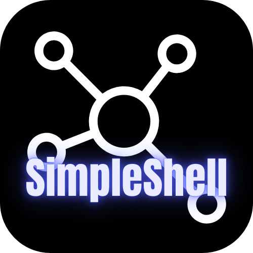

<p align="center">
  
</p>

# SimpleShell - Electron + React 终端应用

这是一个使用 Electron 和 React 构建的终端应用，结合了 Electron 的桌面应用能力和 React 的现代 Web 开发体验。

## 特性

- 使用Electron-forge构建
- 使用 React 和 Material UI 组件库
- 支持暗黑模式
- 离线使用
- 跨平台支持 (Windows, macOS, Linux)
- 使用Xterm.js和SSH2实现SSH和SFTP功能
- 允许SFTP上传下载文件夹
- AI支持

## 开发

### 前提条件

- Node.js 22+ 和 npm

### 安装依赖

```bash
npm install
```

### 开发模式

```bash
npm run start
```

这将启动 React 开发服务器和 Electron 应用。

### 构建应用

```bash
npm run build
```

这将构建 React 应用和 Electron 应用，并生成可分发的安装包。

## 技术栈

- [Electron](https://www.electronjs.org/) - 跨平台桌面应用框架
- [Material UI](https://mui.com/material-ui/) - 组件库
- [TypeScript](https://www.typescriptlang.org/) - 类型安全的 JavaScript

## 许可证

Apache - 2.0
