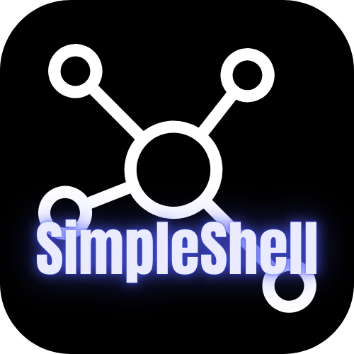

<p align="center">
  
</p>

# SimpleShell - Electron + React 终端应用

这是一个使用 Electron 和 React 构建的终端应用，结合了 Electron 的桌面应用能力和 React 的现代 Web 开发体验。

## 特性

- **核心功能**:
  - 集成 `xterm.js` 和 `ssh2`，提供远程终端和文件传输功能。
  - 文件管理器，用于浏览和管理本地与远程文件。
  - 支持SFTP文件夹上传和下载。
- **AI 助手**:
  - 内置AI助手，帮助用户处理命令和工作流。
- **生产力与用户体验**:
  - 命令历史和建议功能，提升用户输入效率。
  - 连接管理器，用于保存和管理SSH连接配置。
  - 世界地图显示，展示服务器的地理分布。
  - 支持暗黑和明亮模式。
  - 跨平台支持 (Windows, macOS, Linux)。
  - 国际化支持（中英文）。
- **系统与安全工具**:
  - 实时性能和资源监控。
  - 随机密码生成器，增强安全性。
  - IP地址查询工具，快速查找网络信息。
- **性能与架构**:
  - 多级缓存机制，提高数据访问速度。
  - 零拷贝文件传输引擎，提升SFTP效率。
  - 同步命令分发器，用于管理组任务。
  - 背压控制和优化中间件，确保文件传输的稳定性。

## 开发

### 前提条件

- Node.js 22+ 和 npm

### 安装依赖

```bash
npm install
```

### 开发模式

```bash
npm run start
```

这将启动 React 开发服务器和 Electron 应用。

### 构建应用

```bash
npm run make
```

这将构建 React 应用和 Electron 应用，并生成可分发的安装包。

## 技术栈

- [Electron](https://www.electronjs.org/) - 跨平台桌面应用框架
- [Material UI](https://mui.com/material-ui/) - 组件库
- [TypeScript](https://www.typescriptlang.org/) - 类型安全的 JavaScript

## 许可证

Apache - 2.0
